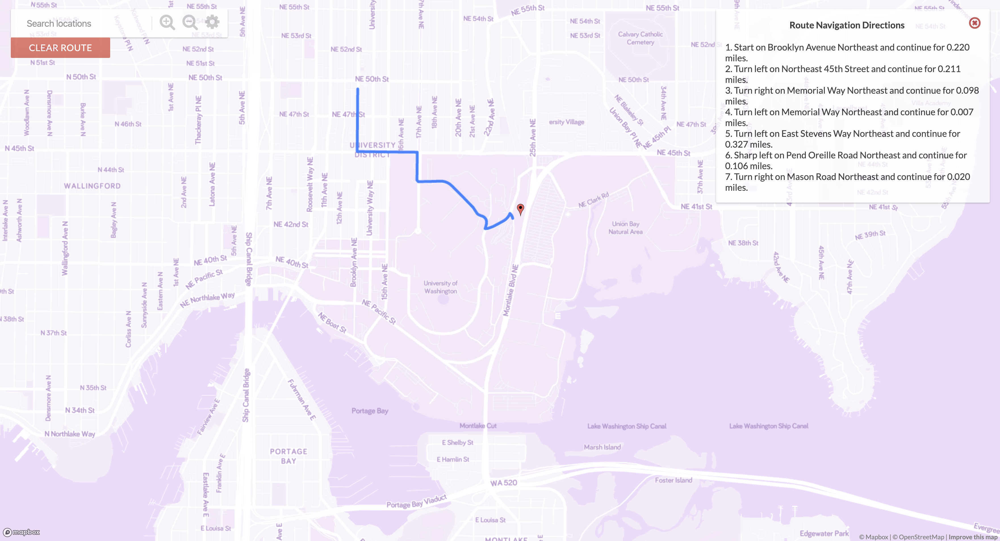

# HuskyMaps Server 
A GoogleMaps-like web application with Point-of-Interest Search, Shortest path finder, and turn-by-turn navigation directions. 
[GitHub](https://huskymaps-joshshih.herokuapp.com/)

## Tools

Fundamental algorithms and data structures for implementation. Techniques for solving problems by programming. Linked lists, stacks, queues, directed graphs. Trees: representations, traversals. Searching (hashing, binary search trees, multiway trees). Garbage collection, memory management. Internal and external sorting. 

